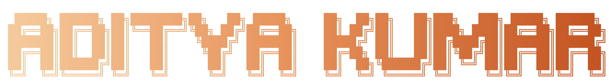

### About me 
- I love building cool things.
- Currently learning **Kubernetes** & **gRPC**.
- Currently building Cadence. 
- My [Resume.](https://github.com/autistic-avenger/resume-archive/blob/main/RESUMES/RESUME_LATEST.pdf?raw=true)

### Skills

### Projects
- **[Cadence](https://github.com/autistic-avenger/Cadence)** Turn long boring videos into short engaging clips using AI.
- **[BlackBox](https://github.com/autistic-avenger/BlackBox)** TUI download manager written in Go.
- **[Droppa](https://github.com/autistic-avenger/droppa)** P2P file transfer over WebRTC.
- **[Armoracrypt](https://github.com/autistic-avenger/armoracrypt)**  Go CLI for cloud file/folder encryption.
- **[Litspots](https://github.com/autistic-avenger/litspots)** Social events hosting/discovery on a map.
- **[Multiplayer Cursor](https://github.com/autistic-avenger/multiplayer-cursor)** Real-time shared cursor tracking for web.

### Achievements

- Selected for ACM Summer School on Symmetric Key Cryptography @IIT Hyderabad 

